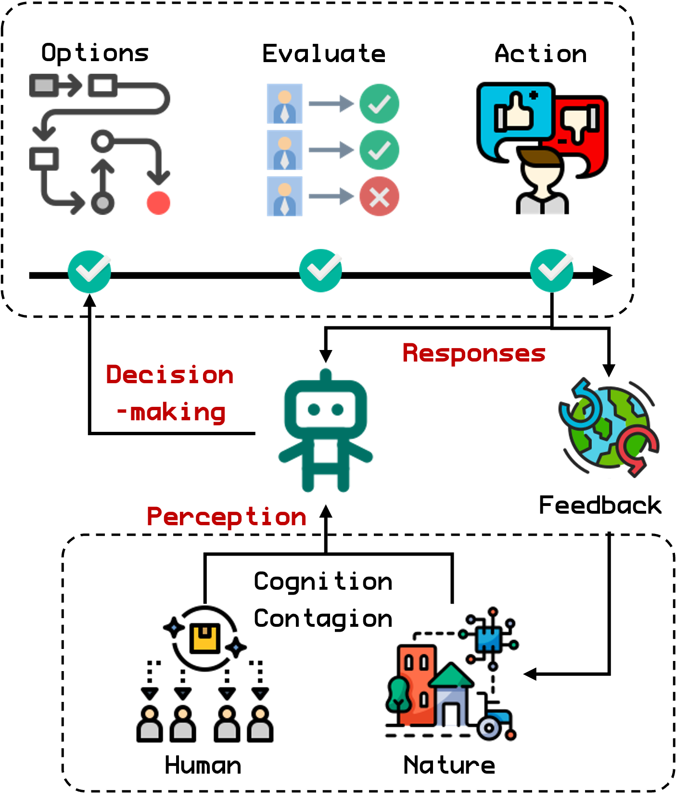

## Summary

`ABSESpy` is a novel agent-based modeling (ABM) framework that facilitates socio-ecological systems (SES) research. It serves as an extension package of `Mesa`, the most popular ABM framework, and further enhances agents' interactions with other components, especially grid-like spaces. With a configuration file for managing parameters and an improved data Input/Output system, `ABSESpy`'s modularity and low-coupling design enable elegant maintenance of large modeling projects. In addition, `ABSESpy` includes a schedule that aligns models' tick with the calendar time. These innovations position `ABSESpy` as a valuable tool in fostering more ABMs for real-world SES issues. Its ultimate aim is to become the go-to choice for ABM when working with a human-involved changing world.

## Statement of need

Social-ecological systems (SES) are integrated concepts recognizing the complex and interdependent dynamics between human societies and ecological systems [@folke2010]. SES consists of decision-making actors (i.e., agents representing people, communities, organizations, and environmental components) capable of following heterogeneous objectives (i.e., agents) [@levin2013]. As such, SES has specific needs for research support from agent-based modeling (ABM).

However, since few models can effectively represent the real-world SES problem, the potential of ABMs has yet to be fully realized in SES research [@schulze2017]. One reason is the variability of actors' interaction with each other or geographic spaces, including learning, decision-making, and contagion across social networks [@reyers2018]. Another reason is the complexity of managing data, parameters, and social and natural processes [@davidson2024], which makes it hard to maintain large projects. Therefore, facilitating SES research with ABM requires novel tools [@schluter2023]to implement the interactions between actors and real-world-like natural processes with manageability and reproducibility.

The popular programming language `Python` is among the first choices for scientists who care about ABM, and `Mesa` [@kazil2020a] is the most widely used implementation framework. It remains extensible for different domains while providing the core functionality of ABM. Therefore, customizing `Mesa` by enhancing real-world representation could be a good start for specializing in SES research. It includes expressing decision-making actors' interactions, social-ecological networks, calendar time, raster data, and extensible sub-systems. To this end, `ABSESpy` is a `Mesa` package and an advanced framework that fills gaps in SES modeling with these features.

## Design structures

`ABSESpy`'s low-coupling design enables the implementation of maintainable projects by separating the human and natural subsystems within SESs (**Figure 1**). While the human subsystem manages actors (i.e., agents) and their interactions, the natural submodule typically handles how actors live in, move through, and interact with grid-like patch layers. This architecture also supports adding specialized submodules in each subsystem to represent varying processes with modularity.

`ABSESpy` includes the default schedule, data collector, and batch runner utilities, available as a `Mesa` package but somehow enhanced. It also introduces a calendar-like time driver and supports configuration management through `.yaml` files. In addition, the packages `Xarray` [@hoyer2017xarray] and `Mesa-Geo` [@wang_mesa-geo_2022] are embedded to implement an Input/Output driver for different geographic datasets (`.tif`, `.nc`, `.json`, `.shp`, and others). The design focuses on two core improvements: (1) handling actors and their interactions and (2) enhancing reality and manageability of ABMs.

## Handling actors and their interactions

Under the context of SES, `ABSESpy` conceptualizes "agents" as `Actor`s managed within a global `ActorsContainer` and can be manipulated in batches through any `ActorsList`. Users can also query, select, or apply a function to a subset of actors by `ActorsList`. Furthermore, whenever users link some `Actor`s with others or some `PatchCell`s, `Networkx` can automatically convert these linkages into a graph. Thus, it enables actors to interact through social networks or implement a social-ecological network analysis.

Since `ABSESpy` recognizes the centrality of human behavior in SES studies, it also provides a standard workflow based on a popular theoretical framework for decision-making (**Figure 2**) [@schluter2017], [@beckage2022]. The following main steps can be implemented seamlessly when working with `ABSESpy`:

1. **Perceptions**:  An `Actor` holds perceptions of natural and human subsystems by observing global/environmental variables (cognition) or learning from links with others (contagion). `ABSESpy` helps users dynamically define an expression to update perceptions as `Actor`s' attributes.
2. **Decision-making**: `Actor`s evaluate potential options to determine how to act in the current situation. `ABSESpy` includes utilities for pre-defined options, thus enabling auto-triggering actions by passing an evaluating function.
3. **Response**: Some actions may lead to feedback towards human or natural subsystems as a response. Besides many available actions, such as spatial relocation and setting attributes, `ABSESpy` also includes tools to avoid the feedback that causes a nested loop.

## Enhancing reality and manageability of ABMs

To enhance reality, `ABSESpy` provides an innovative time control mechanism to bridge the gap between the association of ABM and real-world time (**Figure 3**). In addition to `Mesa`'s standard tick-based time advancement, users can implement calendar temporal modes to match the diverse scales of SES phenomena with `ABSESpy`. The model can represent time intervals from minutes to years by defining the calendar time for each simulation step. This flexibility is crucial when modeling real-world events like natural cycles or periodic human activities.

`ABSESpy` includes utilities for manageability purposes based on the above time control mechanism. The commonly used one is automatically importing and updating temporal time series datasets like monthly or daily weather. Users can also specify time conditions to apply or not apply any model method, such as customizing a "`get_up()`" method to `Actor` and only calling it at 8:00 am in a one-hour-per-step model. Finally, all parameters can be stored in `.yaml` configuration files with readable expressions. For example, passing parameters `{"start": '2022-12-31', "end": 2024-01-01, year: 1}` to the 'time' module means the simulation starts at the end of 2022 and ends when the beginning of 2024 is reached. Since each step represents a year, the model only goes one step.

## Positioning and comparison

By translating theoretical constructs into user-friendly, operational components, `ABSESpy` empowers researchers to bridge the gap between conceptual models and their tangible application in SES. As a specialized `Mesa` package for the emerging SES field, `ABSESpy` can take advantage of most of the benefits from the related projects (e.g., model visualization from `Mesa` and geo-data processing from `Mesa-Geo`). `ABSESpy` aims to become the go-to choice for ABM when working with a human-involved, changing world. This vision is similar to the existing `ABCE` [@taghawi-nejad2017], which aims to provide an economic problem modeling framework (also a `Mesa` package), but it targets real-world SES problems.

Many open-source SES models are published on `CoMSES` [@janssen2008] and use `NetLogo` [@tisue2004netlogo] software. However, users might struggle to maintain its all-in-one structure when data input/output and parameters become extensive. The visible advantage of `ABSESpy` lies in its modularity and low-coupling design, which is suitable for large-scale SES modeling projects. It calls upon vast amounts of actual data for real-world problem modeling. With a separate configuration file, `ABSESpy` makes it easier to maintain a large project, allowing users to couple sub-modules and maximize `Python`'s advantages as a "glue language." In `Python`, another possible competitor is `AgentPy` [@foramitti2021], whose goal is a general ABM framework and is thus more concerned with agents (in other words, the "human" part). Due to more geographic data processing extensions like `Mesa-Geo`, `ABSESpy` allows users to handle grid-like spaces and calendar-like schedules more efficiently. Thus, facing real-world SES problems, building on `ABSESpy` will require less coding effort to simulate interactions between humans and nature.

## Acknowledgment

This research has been supported by the National Natural Science Foundation of China (grant no. 42041007) and the National Natural Science Foundation of China Joint Fund for Scientific Research on Yellow River (grant no. U2243601).

## References
